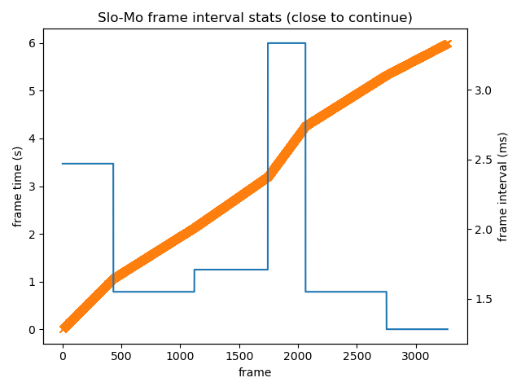

# v2e [](https://opensource.org/licenses/MIT) [](https://colab.research.google.com/drive/1czx-GJnx-UkhFVBbfoACLVZs8cYlcr_M?usp=sharing)

Python torch + opencv code to go from conventional stroboscopic video frames with low frame rate into realistic synthetic DVS event streams with much higher effective timing precision. v2e includes finite intensity-depenedent photoreceptor bandwidth, Gaussian pixel to pixel event threshold variation, and noise 'leak' events.

See the [v2e home page](https://sites.google.com/view/video2events/home) for videos and further information. 

Our paper (below) about _v2e_ **debunks incorrect assertions about event cameras that pervade the current computer vision literature.**

See [v2e-sample-input-data](https://drive.google.com/drive/folders/1oWxTB9sMPp6UylAdxg5O1ko_GaIXz7wo?usp=sharing) for sample input files.


Vote for [new v2e features](https://docs.google.com/forms/d/e/1FAIpQLSdJoIH3wBkPANWTng56VeXiItkh_fl5Lz3QwZIpQ6ut1AMFCw/viewform?usp=sf_link).

v2e development was supported by the Swiss National Competence Center for Robotics [(NCCR Robotics)](https://nccr-robotics.ch/).

## News

See [changelog](https://github.com/SensorsINI/v2e/blob/master/CHANGELOG.md) for latest news

## Contact
Yuhuang Hu (yuhuang.hu@ini.uzh.ch)
Tobi Delbruck (tobi@ini.uzh.ch)

### Citation
If you use v2e, we appreciate a citation to the paper below. See the [v2e home page](https://sites.google.com/view/video2events/home) for futher background papers.

+ Y. Hu, S-C. Liu, and T. Delbruck. v2e: From Video Frames to Realistic DVS Events. In _2021 IEEE/CVF  Conference  on  Computer  Vision  and  Pattern Recognition Workshops (CVPRW)_, URL: https://arxiv.org/abs/2006.07722, 2021

To reproduce the experiments of the paper, please find [this repository](https://github.com/SensorsINI/v2e_exps_public).

### Advice about conversion time
We recommend running _v2e_ on a CUDA GPU or it will be very slow, particularly when using SuperSloMo upsampling. 
Even with a low-end GTX-1050, _v2e_ runs about 50-200X slower than real time 
using 10X slowdown factor and 346x260 video.

Conversion speed depends linearly on the reciprocal of the desired DVS timestamp resolution.
If you demand fine resolution of e.g. 100us, 
then expect many minutes of computing per second of source video. Running on Google colab
with GPU, it took 500s per second of 12FPS source video, because of the very high upsampling ratio
of over 800X and the 220k frames that needed to be produced for DVS modeling.

We advise using the _--stop_ option for trial run before starting a long conversion.
## Using v2e in Google CoLab
If you don't want to install, try [opening v2e in google colab](https://colab.research.google.com/drive/1czx-GJnx-UkhFVBbfoACLVZs8cYlcr_M?usp=sharing).

## Local Installation
There are 3 general steps
1. Make a _conda_ environment
2. Install _pytoch_ and other _conda_ distributed packages to this environment
3. Install the rest of the packages and _v2e_ to the conda enviroment with _pip_.

_pip_ is needed because some packages are not availble from the conda repositories. It is important to go in this order because _conda_ in general is not aware of _pip_ installs.

### Make conda environment
Install _v2e_ to a separate Python environment
such as `conda` environment:

```bash
conda create -n v2e python=3.10  # create a new environment
conda activate v2e  # activate the environment
```
### Ensure you have CUDA enabled GPU-accelerated _pytorch_
See https://pytorch.org/get-started/locally/ to generate the correct
conda install command to enable GPU-accelerated CUDA. On windows 10, for example, this tool generated the following command. _v2e_ does not use _torchaudio_ so you can leave it out.
```
conda install pytorch torchvision torchaudio cudatoolkit=11.3 -c pytorch
```

You may want to check this stackoverflow question:
https://stackoverflow.com/questions/57238344/i-have-a-gpu-and-cuda-installed-in-windows-10-but-pytorchs-torch-cuda-is-availa

### Use pip to install rest of packages and v2e
After installing pytorch to your CUDA environment, to install v2e in developer mode (so your edits to source take effect immediately), run the following command in your terminal inside the activated conda environment. The `python -m pip install -e .` command runs _setup.py_ which installs more packages and adds a script to run _v2e_ from the command line to the _conda_ enviroment python path; see https://stackoverflow.com/questions/39023758/what-does-pip-install-dot-mean:
```bash
conda activate v2e # activate your env with pytoch already installed by conda
git clone https://github.com/SensorsINI/v2e
cd v2e
python -m pip install -e . # use pip to install requirements from setup.py in user mode (so your edits to source files in v2e take effect immediately
```

+ If you want an additional Windows GUI interface, you will need to install [Gooey](https://github.com/chriskiehl/Gooey) package. This package works the best on Windows:
    ```bash
    pip install Gooey
    ```
    On Linux, `Gooey` can be hard to install.

    For a sample of conversion using the gooey GUI, see https://youtu.be/THJqRC_q2kY

### Download SuperSloMo model

We use the excellent [Super SloMo](https://people.cs.umass.edu/~hzjiang/projects/superslomo/) framework to interpolate the APS frames.
However, since APS frames only record light intensity, we  retrained it on grayscale images.

Download our pre-trained model checkpoint from Google Drive
[SuperSloMo39.ckpt](https://drive.google.com/file/d/1ETID_4xqLpRBrRo1aOT7Yphs3QqWR_fx/view?usp=sharing) (151 MB) and save it to the _input_ folder. 
The default value of --slomo_model argument is set to this location.

Special thanks to Zhe He for recovering the checkpoint file.

### Download sample input data
The sample input videos to try _v2e_ with are in [v2e-sample-input-data](https://drive.google.com/drive/folders/1oWxTB9sMPp6UylAdxg5O1ko_GaIXz7wo?usp=sharing) on google drive.

Download the [tennis.mov](https://drive.google.com/file/d/1dNUXJGlpEM51UVYH4-ZInN9pf0bHGgT_/view?usp=sharing)
video and put in the _input_ folder
to run the example below.

## Usage

_v2e_ serves multiple purposes. Please read to code if you would like to adapt it for your own application. Here, we only introduce the usage for generating DVS events from conventional video and from specific datasets.

## Render emulated DVS events from conventional video.

_v2e.py_ reads a standard video (e.g. in .avi, .mp4, .mov, or .wmv), or a folder of images, and generates emulated DVS events at upsampled timestamp resolution.

Don't be intimidated by the huge number of options. Running _v2e.py_ with no arguments sets reasonable values and opens a file browser to let you select an input video. Inspect the logging output for hints.

**Hint:** Note the options _[--dvs128 | --dvs240 | --dvs346 | --dvs640 | --dvs1024]_; they set output size and width to popular DVS cameras.

**On headless platforms**, with no graphics output, use --no_preview option to suppress the OpenCV windows.

```
usage: v2e.py [-h] [-o OUTPUT_FOLDER] [--avi_frame_rate AVI_FRAME_RATE]
              [--output_in_place [OUTPUT_IN_PLACE]] [--overwrite]
              [--unique_output_folder [UNIQUE_OUTPUT_FOLDER]]
              [--skip_video_output]
              [--auto_timestamp_resolution [AUTO_TIMESTAMP_RESOLUTION]]
              [--timestamp_resolution TIMESTAMP_RESOLUTION]
              [--dvs_params DVS_PARAMS] [--pos_thres POS_THRES]
              [--neg_thres NEG_THRES] [--sigma_thres SIGMA_THRES]
              [--cutoff_hz CUTOFF_HZ] [--leak_rate_hz LEAK_RATE_HZ]
              [--shot_noise_rate_hz SHOT_NOISE_RATE_HZ]
              [--photoreceptor_noise]
              [--leak_jitter_fraction LEAK_JITTER_FRACTION]
              [--noise_rate_cov_decades NOISE_RATE_COV_DECADES]
              [--refractory_period REFRACTORY_PERIOD]
              [--dvs_emulator_seed DVS_EMULATOR_SEED]
              [--show_dvs_model_state SHOW_DVS_MODEL_STATE [SHOW_DVS_MODEL_STATE ...]]
              [--save_dvs_model_state]
              [--record_single_pixel_states RECORD_SINGLE_PIXEL_STATES]
              [--output_height OUTPUT_HEIGHT] [--output_width OUTPUT_WIDTH]
              [--dvs128 | --dvs240 | --dvs346 | --dvs640 | --dvs1024]
              [--disable_slomo] [--slomo_model SLOMO_MODEL]
              [--batch_size BATCH_SIZE] [--vid_orig VID_ORIG]
              [--vid_slomo VID_SLOMO] [--slomo_stats_plot] [-i INPUT]
              [--input_frame_rate INPUT_FRAME_RATE]
              [--input_slowmotion_factor INPUT_SLOWMOTION_FACTOR]
              [--start_time START_TIME] [--stop_time STOP_TIME] [--crop CROP]
              [--hdr] [--synthetic_input SYNTHETIC_INPUT]
              [--dvs_exposure DVS_EXPOSURE [DVS_EXPOSURE ...]]
              [--dvs_vid DVS_VID] [--dvs_vid_full_scale DVS_VID_FULL_SCALE]
              [--no_preview] [--ddd_output] [--dvs_h5 DVS_H5]
              [--dvs_aedat2 DVS_AEDAT2] [--dvs_text DVS_TEXT]
              [--label_signal_noise] [--cs_lambda_pixels CS_LAMBDA_PIXELS]
              [--cs_tau_p_ms CS_TAU_P_MS] [--scidvs]
v2e: generate simulated DVS events from video.
optional arguments:
  -h, --help            show this help message and exit
Output: General:
  -o OUTPUT_FOLDER, --output_folder OUTPUT_FOLDER
                        folder to store outputs.
  --avi_frame_rate AVI_FRAME_RATE
                        frame rate of output AVI video files; only affects
                        playback rate.
  --output_in_place [OUTPUT_IN_PLACE]
                        store output files in same folder as source video (in
                        same folder as frames if using folder of frames).
  --overwrite           overwrites files in existing folder (checks existence
                        of non-empty output_folder).
  --unique_output_folder [UNIQUE_OUTPUT_FOLDER]
                        If specifying --output_folder, makes unique output
                        folder based on output_folder, e.g. output1 (if non-
                        empty output_folder already exists)
  --skip_video_output   Skip producing video outputs, including the original
                        video, SloMo video, and DVS video. This mode also
                        prevents showing preview of output (cf --no_preview).
DVS timestamp resolution:
  --auto_timestamp_resolution [AUTO_TIMESTAMP_RESOLUTION]
                        (Ignored by --disable_slomo or --synthetic_input.) If
                        True (default), upsampling_factor is automatically
                        determined to limit maximum movement between frames to
                        1 pixel. If False, --timestamp_resolution sets the
                        upsampling factor for input video. Can be combined
                        with --timestamp_resolution to ensure DVS events have
                        at most some resolution.
  --timestamp_resolution TIMESTAMP_RESOLUTION
                        (Ignored by --disable_slomo or --synthetic_input.)
                        Desired DVS timestamp resolution in seconds;
                        determines slow motion upsampling factor; the video
                        will be upsampled from source fps to achieve the at
                        least this timestamp resolution.I.e. slowdown_factor =
                        (1/fps)/timestamp_resolution; using a high resolution
                        e.g. of 1ms will result in slow rendering since it
                        will force high upsampling ratio. Can be combind with
                        --auto_timestamp_resolution to limit upsampling to a
                        maximum limit value.
DVS model:
  --dvs_params DVS_PARAMS
                        Easy optional setting of parameters for DVS
                        model:None, 'clean', 'noisy'; 'clean' turns off noise,
                        sets unlimited bandwidth and makes threshold variation
                        small. 'noisy' sets limited bandwidth and adds leak
                        events and shot noise.This option by default will
                        disable user set DVS parameters. To use custom DVS
                        paramters, use None here.
  --pos_thres POS_THRES
                        threshold in log_e intensity change to trigger a
                        positive event.
  --neg_thres NEG_THRES
                        threshold in log_e intensity change to trigger a
                        negative event.
  --sigma_thres SIGMA_THRES
                        1-std deviation threshold variation in log_e intensity
                        change.
  --cutoff_hz CUTOFF_HZ
                        photoreceptor IIR lowpass filter cutoff-off 3dB
                        frequency in Hz - see
                        https://ieeexplore.ieee.org/document/4444573.CAUTION:
                        See interaction with timestamp_resolution and
                        auto_timestamp_resolution; check output logger
                        warnings. The input sample rate (frame rate) must be
                        fast enough to for accurate IIR lowpass filtering.
  --leak_rate_hz LEAK_RATE_HZ
                        leak event rate per pixel in Hz - see
                        https://ieeexplore.ieee.org/abstract/document/7962235
  --shot_noise_rate_hz SHOT_NOISE_RATE_HZ
                        Temporal noise rate of ON+OFF events in darkest parts
                        of scene; reduced in brightest parts.
  --photoreceptor_noise
                        Create temporal noise by injecting Gaussian noise to
                        the log photoreceptor before lowpass filtering.This
                        way, more accurate statistics of temporal noise will
                        tend to result (in particular, alternating ON and OFF
                        noise events)but the noise rate will only approximate
                        the desired noise rate; the photoreceptor noise will
                        be computed to result in the --shot_noise_rate noise
                        value. Overrides the default shot noise mechanism
                        reported in 2020 v2e paper.
  --leak_jitter_fraction LEAK_JITTER_FRACTION
                        Jitter of leak noise events relative to the (FPN)
                        interval, drawn from normal distribution
  --noise_rate_cov_decades NOISE_RATE_COV_DECADES
                        Coefficient of Variation of noise rates (shot and
                        leak) in log normal distribution decades across pixel
                        arrayWARNING: currently only in leak events
  --refractory_period REFRACTORY_PERIOD
                        Refractory period in seconds, default is 0.5ms.The new
                        event will be ignore if the previous event is
                        triggered less than refractory_period ago.Set to 0 to
                        disable this feature.
  --dvs_emulator_seed DVS_EMULATOR_SEED
                        Set to a integer >0 to use a fixed random seed.default
                        is 0 which means the random seed is not fixed.
  --show_dvs_model_state SHOW_DVS_MODEL_STATE [SHOW_DVS_MODEL_STATE ...]
                        One or more space separated list model states. Do not
                        use '='. E.g. '--show_dvs_model_state all'. Possible
                        models states are (without quotes) either 'all' or
                        chosen from dict_keys(['new_frame', 'log_new_frame',
                        'lp_log_frame', 'scidvs_highpass',
                        'photoreceptor_noise_arr', 'cs_surround_frame',
                        'c_minus_s_frame', 'base_log_frame', 'diff_frame'])
  --save_dvs_model_state
                        save the model states that are shown (cf
                        --show_dvs_model_state) to avi files
  --record_single_pixel_states RECORD_SINGLE_PIXEL_STATES
                        Record internal states of a single pixel specified by
                        (x,y) tuple to 'pixel-states.dat'.The file is a
                        pickled binary dict that has the state arrays over
                        time imcluding a time array.Pixel location can also be
                        specified as x,y without ()
DVS camera sizes (selecting --dvs346, --dvs640, etc. overrides --output_width and --output_height:
  --output_height OUTPUT_HEIGHT
                        Height of output DVS data in pixels. If None, same as
                        input video. Use --output_height=260 for Davis346.
  --output_width OUTPUT_WIDTH
                        Width of output DVS data in pixels. If None, same as
                        input video. Use --output_width=346 for Davis346.
  --dvs128              Set size for 128x128 DVS (DVS128)
  --dvs240              Set size for 240x180 DVS (DAVIS240)
  --dvs346              Set size for 346x260 DVS (DAVIS346)
  --dvs640              Set size for 640x480 DVS (DAVIS640)
  --dvs1024             Set size for 1024x768 DVS (not supported for AEDAT-2.0
                        output since there is no jAER DVS1024 camera
SloMo upsampling (see also "DVS timestamp resolution" group):
  --disable_slomo       Disables slomo interpolation; the output DVS events
                        will have exactly the timestamp resolution of the
                        source video (which is perhaps modified by
                        --input_slowmotion_factor).
  --slomo_model SLOMO_MODEL
                        path of slomo_model checkpoint.
  --batch_size BATCH_SIZE
                        Batch size in frames for SuperSloMo. Batch size 8-16
                        is recommended if your GPU has sufficient memory.
  --vid_orig VID_ORIG   Output src video at same rate as slomo video (with
                        duplicated frames). Specify emtpy string or 'None' to
                        skip output.
  --vid_slomo VID_SLOMO
                        Output slomo of src video slowed down by
                        slowdown_factor.Specify emtpy string or 'None' to skip
                        output.
  --slomo_stats_plot    show a plot of slomo statistics
Input file handling:
  -i INPUT, --input INPUT
                        Input video file or a image folder; leave empty for
                        file chooser dialog.If the input is a folder, the
                        folder should contain a ordered list of image files.In
                        addition, the user has to set the frame rate manually.
  --input_frame_rate INPUT_FRAME_RATE
                        Either override the video file metadata frame rate or
                        manually define the video frame rate when the video is
                        presented as a list of image files. Overrides the
                        stored (metadata) frame rate of input video. This
                        option overrides the --input_slowmotion_factor
                        argument in case the input is from a video file.
  --input_slowmotion_factor INPUT_SLOWMOTION_FACTOR
                        (See --input_frame_rate argument too.) Sets the known slow-motion factor of the input video, 
                        i.e. how much the video is slowed down, i.e., 
                        the ratio of shooting frame rate to playback frame rate. 
                        input_slowmotion_factor<1 for sped-up video and 
                        input_slowmotion_factor>1 for slowmotion video.
                        If an input video is shot at 120fps yet is presented as a 30fps video 
                        (has specified playback frame rate of 30Hz, 
                        according to file's FPS setting), 
                        then set --input_slowdown_factor=4.
                        It means that each input frame represents (1/30)/4 s=(1/120)s.
                        If input is video with intended frame intervals of 
                        1ms that is in AVI file 
                        with default 30 FPS playback spec, 
                        then use ((1/30)s)*(1000Hz)=33.33333.
  --start_time START_TIME
                        Start at this time in seconds in video. Use None to
                        start at beginning of source video.
  --stop_time STOP_TIME
                        Stop at this time in seconds in video. Use None to end
                        at end of source video.
  --crop CROP           Crop input video by (left, right, top, bottom) pixels.
                        E.g. CROP=(100,100,0,0) crops 100 pixels from left and
                        right of input frames. CROP can also be specified as
                        L,R,T,B without ()
  --hdr                 Treat input video as high dynamic range (HDR)
                        logarithmic, i.e. skip the linlog conversion step. Use
                        --hdr for HDR input with floating point gray scale
                        input videos. Units of log input are based on white
                        255 pixels have values ln(255)=5.5441
Synthetic input:
  --synthetic_input SYNTHETIC_INPUT
                        Input from class SYNTHETIC_INPUT that has methods
                        next_frame() and total_frames(). Disables file input
                        and SuperSloMo frame interpolation and the DVS
                        timestamp resolution is set by the times returned by
                        next_frame() method. SYNTHETIC_INPUT.next_frame()
                        should return a tuple (frame, time) with frame having
                        the correct resolution (see DVS model arguments) which
                        is array[y][x] with pixel [0][0] at upper left corner
                        and pixel values 0-255. The time is a float in
                        seconds. SYNTHETIC_INPUT must be resolvable from the
                        classpath. SYNTHETIC_INPUT is the module name without
                        .py suffix. See example moving_dot.py.
Output: DVS video:
  --dvs_exposure DVS_EXPOSURE [DVS_EXPOSURE ...]
                        Mode to finish DVS frame event integration:
                        	duration time: Use fixed accumulation time in seconds, e.g. 
                        		--dvs_exposure duration .005; 
                        	count n: Count n events per frame,e.g.
                        		--dvs_exposure count 5000;
                        	area_count M N: frame ends when any area of N x N pixels fills with M events, e.g.
                        		-dvs_exposure area_count 500 64
                        	source: each DVS frame is from one source frame (slomo or original, depending on if slomo is used)
  --dvs_vid DVS_VID     Output DVS events as AVI video at frame_rate. To
                        suppress, supply empty argument or 'None'.
  --dvs_vid_full_scale DVS_VID_FULL_SCALE
                        Set full scale event count histogram count for DVS
                        videos to be this many ON or OFF events for full white
                        or black.
  --no_preview          disable preview in cv2 windows for faster processing.
Output: DVS events:
  --ddd_output          Save frames, frame timestamp and corresponding event
                        index in HDF5 format used for DDD17 and DDD20
                        datasets. Default is False.
  --dvs_h5 DVS_H5       Output DVS events as hdf5 event database.
  --dvs_aedat2 DVS_AEDAT2
                        Output DVS events as DAVIS346 camera AEDAT-2.0 event
                        file for jAER; one file for real and one file for v2e
                        events. To suppress, supply argument None.
  --dvs_text DVS_TEXT   Output DVS events as text file with one event per line
                        [timestamp (float s), x, y, polarity (0,1)].
  --label_signal_noise  append to the --dvs_text file a column,containing list
                        of signal and shot noise events. Each row of the CSV
                        appends a 1 for signal and 0 for noise.** Notes: 1:
                        requires activating --dvs_text option; 2: requires
                        disabling --photoreceptor_noise option (because when
                        noise arises from photoreceptor it is impossible to
                        tell if event was caused by signal or noise.3: Only
                        labels shot noise events (because leak noise events
                        arise from leak and cannot be distinguished from
                        photoreceptor input).
Center-Surround DVS:
  --cs_lambda_pixels CS_LAMBDA_PIXELS
                        space constant of surround in pixels, None to disable.
                        This space constant lambda is sqrt(1/gR) where g is
                        the transverse conductance and R is the lateral
                        resistance.
  --cs_tau_p_ms CS_TAU_P_MS
                        time constant of photoreceptor center of diffuser in
                        ms, or 0 to disable for instantaneous surround.
                        Defined as C/g where C is capacitance and g is the
                        transverse conductance from photoreceptor to
                        horizontal cell network. This time isthe time constant
                        for h cell diffuser network response time to global
                        input to photoreceptors. If set to zero, then the
                        simulation of diffuser runs until it converges, i.e.
                        until the maximum change between timesteps is smaller
                        than a threshold value
SCIDVS pixel:
  --scidvs              Simulate proposed SCIDVS pixel with nonlinear
                        adapatation and high gain
Run with no --input to open file dialog
```
You can put [tennis.mov](https://drive.google.com/file/d/1dNUXJGlpEM51UVYH4-ZInN9pf0bHGgT_/view?usp=sharing) in the _input_ folder to try it out with the command line below.  Or leave out all options and just use the file chooser to select the movie.

From root of v2e, run the following
```
python v2e.py -i input/tennis.mov --overwrite --timestamp_resolution=.003 --auto_timestamp_resolution=False --dvs_exposure duration 0.005 --output_folder=output/tennis --overwrite --pos_thres=.15 --neg_thres=.15 --sigma_thres=0.03 --dvs_aedat2 tennis.aedat --output_width=346 --output_height=260 --stop_time=3 --cutoff_hz=15 
```
Run the command above, and the following files will be created in a folder called _output/tennis_.

```
dvs-video.avi
dvs-video-frame_times.txt
tennis.aedat
v2e-args.txt
video_orig.avi
video_slomo.avi
```

* _dvs-video.avi_: DVS video (with playback rate 30Hz) but with frame rate (DVS timestamp resolution) set by source video frame rate times slowdown_factor.
* _dvs-video-frame_times.txt_: The times of the DVS frames. Useful when _--dvs_exposure count_ or _--dvs_exposure area-count_ methods are used.
* _tennis.aedat_: AEDAT-2.0 file for playback and algorithm experiments in [jAER](https://jaerproject.net) (use the AEChip _Davis346Blue_ to play this file.)
* _v2e-args.txt_: All the parameters and logging output from the run.
* _video_orig.avi_: input video, but converted to luma and resized to output (width,height) and with repeated frames to allow comparison to _slomo.avi_.
* _video_slomo.avi_: slow motion video (with playback rate 30Hz) but slowed down by slowdown_factor.

The [v2e site](https://sites.google.com/view/video2events/home) shows these videos.
## Scripting v2e
See the [scripts folder](https://github.com/SensorsINI/v2e/blob/master/scripts)  for various samples of shell and cmd scripts to run v2e from terminal.

### Synthetic input

There are also samples in the [scripts folder](https://github.com/SensorsINI/v2e/blob/master/scripts) of 
python modules to generate synthetic input to v2e, e.g. [particles.py](https://github.com/SensorsINI/v2e/blob/master/scripts/particles.py)

You can specify particles as the class that generates input frames to generate DVS events from using the command line option
````shell
v2e --synthetic_input scripts.particles ...
````
You synthetic input class should subclass _base_synthetic_class.py_. You should override the constructor and the _next_frame()_ method.

  * See [base_synthetic_input.py](https://github.com/SensorsINI/v2e/blob/master/scripts/base_synthetic_input.py) for more information.
  * You can pass command line arguments into your class; see [particles.py](https://github.com/SensorsINI/v2e/blob/master/scripts/particles.py) for example.

## Model parameters

The DVS ON and OFF threshold nominal values are set by _pos_thres_ and _neg_thres_. The pixel to pixel variation is set by _sigma_thres_. The pixel cutoff frequency in Hz is set by _cutoff_hz_. The leak event rate is set by _leak_rate_hz_. 

The _-dvs_params_ argument sets reasonable DVS model parameters for high and low light conditions.

See our technical paper for futher information about these parameters.
 
 ### Automatic vs manual DVS timestamp resolution
 The output DVS timestamps will be quantized to some value depending on options chosen.
 
  *  _--disable_slomo_ will disable slomo interpolation and the DVS events will have exactly the times of the input video, perhaps modified by --input_slowmotion_factor
  *  _--timestamp_resolution=X_ will upsample as needed to obtain this desired timestamp resolution _X_ in seconds. If auto_timestamp_resolution is set, then timestamp_resolution will still set the minimum timestamp resolution, i.e. if automatic timestamping would result in 5ms timestamps but timestamp_resolution is 1ms, then 1ms will still be the timestamp resolution.
  *  _--auto_timestamp_resolution_ will upsample in each _--batch_size_ frames using the computed optical flow to limit motion per frame to at most 1 pixel. In this case, turning on _--slomo_stats_plot_ will generate a plot like the following, which came from a driving video where the car sped up during part of the video:
 
 
 
 This plot shows the actual timestamps of the interpolated frames (in orange) and the frame intervals for each batch of frames (in blue).
 
### Photoreceptor lowpass filtering
_v2e_ includes an intensity-dependent 1st-order lowpass filtering of light intensity; see the paper for details. 
If you set a nonzero --cutofffreq_hz, then it is important that the sample rate be high enough to allow the IIR lowpass filters to update properly, i.e.
the time constant tau of the lowpass filters must be at least 3 times larger than the frame interval.
Check the console output for warnings about undersampling for lowpass filtering.


 
 ### Frame rate and DVS timestamp resolution in v2e
There are several different 'frame rates' in v2e. On opening the input video, v2e reads the frame rate of the video and assumes the video is shot in real time, except that you can specify a _--input_slowmotion_factor_ slowdown_factor if the video is already a slow-motion video. The desired DVS timestamp resolution is combined with the source frame rate to compute the slow-motion upsampling factor. The output DVS AVI video is then generated using a _--dvs-exposure_ method.

 * _--avi_frame_rate_: Just sets the frame rate for playback of output AVI files
 * _--dvs-exposure_: See next section
 * _--input_slowmotion_factor_: Specifies by what factor the input video is slowed down.
 
### Effect of multiple events per (sub) frame
Anytime a source (or upsampled source) video generates more than 1 event per frame, these events need to be distributed over the time between frames. v2e arbitrarily stacks them as shown in the example below, resulting in pyramids of events and periodic overall bursts of events at each frame.  I.e. v2e first computes the maximum number of events by any pixel, then it subdivides the interframe interval by this number, then it puts all pixels with 1 event at the frame, then pixels with 2 events have thier events placed at the first sub-interval and so on. The reduce this effect, use a smaller timestamp resolution.

 

## DVS frame exposure modes

The DVS allows arbritrary frame rates. _v2e_ provides 3 methods to 'expose' DVS video frames, which are selected by the
--dvs_exposure argument:
 1. **Constant-Duration**: _--dvs_exposure _duration_ _T__:  - Each frame has constant duration _T_.
 2. **Constant-Count**: _--dvs_exposure_count_ _N_:  - each frame has the same number _N_ of DVS events, as first described in Delbruck, Tobi. 2008. “Frame-Free Dynamic Digital Vision.” In Proceedings of Intl. Symp. on Secure-Life Electronics, Advanced Electronics for Quality Life and Society, 1:21–26. Tokyo, Japan: Tokyo. https://drive.google.com/open?id=0BzvXOhBHjRheTS1rSVlZN0l2MDg..
 3. **Area-Event**: _--dvs_exposure_ _area_event_ _N_ _M_:  - frames are accumulated until any block of *M*x*M* pixels fills up with _N_ events, as first described in Liu, Min, and T. Delbruck. 2018. “Adaptive Time-Slice Block-Matching Optical Flow Algorithm for Dynamic Vision Sensors.” In Proceedings of British Machine Vision Conference (BMVC 2018). Newcastle upon Tyne, UK: Proceedings of BMVC 2018. https://doi.org/10.5167/uzh-168589.
 4. **Source**: _--dvs_exposure source_: DVS timestamps are based on source video timestamps. Extra events per frame are spaced between frames accoruding to the maximum number of events for that frame.

 - _Constant-Duration_ is like normal video, i.e. sampled at regular, ideally Nyquist rate. 
 - _Constant-Count_ frames have the same number of pixel brightness change events per frame. But if the scene is very textured (i.e. busy) then frame can get very brief, while parts of the input with only a small object moving can have very long frames.
 - _Area-Event_ compensates for this effect to some extent by concluding exposure when any block of pixels fills with a constant count.

## DAVIS camera conversion Dataset

v2e can convert recordings from
 [DDD20](https://sites.google.com/view/davis-driving-dataset-2020/home) and the original [DDD17](https://docs.google.com/document/d/1HM0CSmjO8nOpUeTvmPjopcBcVCk7KXvLUuiZFS6TWSg/pub) 
which are the first public end-to-end training datasets 
of automotive driving using a DAVIS event + frame camera. It lets you compare the real DVS data with the conversion. 
This dataset is maintained by the Sensors Research Group of Institute of Neuroinformatics. 

For your convenience, we offer via google drive one recording from _DDD20_ (our newer DDD dataset) of 800s of
Los Angeles street driving. 
The file is _aug04/rec1501902136.hdf5_ [[link]](https://drive.google.com/open?id=1KIaHsn72ZpVBZR6SGeFcd2lILyZoD2-5)
  in Google Drive for you to try it with v2e (***Warning:*** 2GB 7z compressed, 5.4 GB uncompressed).

```bash
mkdir -p input
mv rec1501902136.hdf5 ./input
```

**NOTE** you must run these scripts with the _-m package.script.py_ notation, not by directly pointing to the .py file.

### Extract data from DDD recording

_ddd_h5_extract_data.py_ extracts the DDD recording DVS events to jAER _.aedat_ and video _.avi_ files.

```
ddd_extract_data.py -h
usage: ddd_extract_data.py [-h] [-i INPUT] -o OUTPUT_FOLDER [--start_time START_TIME] [--stop_time STOP_TIME] [--rotate180] [--overwrite] [--dvs240] [--dvs346]

Extract data from DDD recording

optional arguments:
  -h, --help            show this help message and exit
  -i INPUT, --input INPUT
                        input video file; leave empty for file chooser dialog (default: None)
  -o OUTPUT_FOLDER, --output_folder OUTPUT_FOLDER
                        folder to store outputs (default: None)
  --start_time START_TIME
                        start at this time in seconds in video (default: None)
  --stop_time STOP_TIME
                        stop point of video stream (default: None)
  --rotate180           rotate output 180 deg (default: False)
  --overwrite           overwrites files in existing folder (checks existance of non-empty output_folder) (default: False)
  --dvs240              Set size for 240x180 DVS (Davis240). Use for DDD17 recording. (default: False)
  --dvs346              Set size for 346x260 DVS (Davis346). Use for DDD20 recording. (default: False)

Run with no --input to open file dialog

```

You can then synthesize events from the DDD APS video .avi file that is produced and compare with the real events extracted to the AEDAT-2.0 file that is also extracted.


## Working with jAER DAVIS recordings

DAVIS cameras like the one that recorded DDD17 and DDD20 are often used with [jAER](https://jaerproject.net) (although DDD recordings were made with custom python wrapper around caer). _v2e_ will output a jAER-compatible .aedat file in [AEDAT-2.0 format](https://inivation.com/support/software/fileformat/#aedat-20), which jAER uses.

To work with existing jAER DAVIS .aedat, you can export the DAVIS APS frames using the jAER EventFilter [DavisFrameAVIWriter](https://github.com/SensorsINI/jaer/blob/master/src/ch/unizh/ini/jaer/projects/davis/frames/DavisFrameAviWriter.java); see the [jAER user guide](https://docs.google.com/document/d/1fb7VA8tdoxuYqZfrPfT46_wiT1isQZwTHgX8O22dJ0Q/edit?usp=sharing), in particular, the [section about using DavisFrameAVIWriter](https://docs.google.com/document/d/1fb7VA8tdoxuYqZfrPfT46_wiT1isQZwTHgX8O22dJ0Q/edit#heading=h.g4cschniofmo). In DavisFrameAVIWriter, **don't forget to set the frameRate to the actual frame rate of the DAVIS frames** (which you can see at the top of the jAER display). This will make the conversion have approximately the correct DVS event timing. (jAER can drop APS frames if there are too many DVS events, so don't count on this.) Once you have the AVI from jAER, you can generate v2e events from it with _v2e.py_ and see how they compare with the original DVS events in jAER, by playing the exported v2e .aedat file in jAER.

An example of this conversion and comparison is on the [v2e home page](https://sites.google.com/view/video2events/home).

## Technical Details ##

See the [v2e home page](https://sites.google.com/view/video2events/home).
