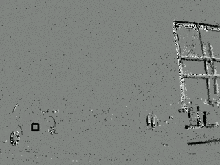
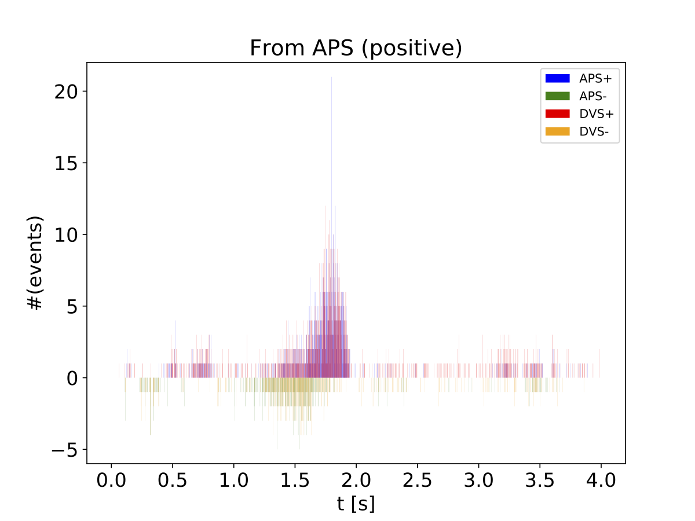

# v2e [](https://opensource.org/licenses/MIT)

Python torch + opencv code for converting APS video frames with low frame rate into DVS event camera frames with high frame rate.

## Contact
Zhe He (hezhehz@live.cn)
Yuhuang Hu (yuhuang.hu@ini.uzh.ch)
Tobi Delbruck (tobi@ini.uzh.ch)

## Environment

```bash
python==3.7.3
```

We highly recommend running the code in virtual environment. Miniconda is always your best friend. :)

## Install Dependencies

```bash
pip install -r requirements.txt
```

The packages listed below will be installed.
```bash
h5py==2.9.0
numpy==1.16.2
opencv-python==4.1.0.25
Pillow==5.4.1
torch==1.1.0
torchvision==0.2.1
tqdm==4.31.1
```
For conda users, you can first make an env with pip in it, then install with pip. The torch and opencv-python packages are not available in conda.

```bash
conda create -n pt-v2e python=3.7 pip
conda activate pt-v2e
pip install -r requirements.txt
```

## Usage

The program is designed to serve multiple purposes. Please read to code if you would like to adapt it for your own application. Here, we only introduce the usage for extracting DVS events from APS frames.

**NOTE** It is highly recommended to run the APS-to-DVS conversion scripts on GPUs.

## Dataset

DDD17+ is the first public end-to-end training dataset of automotive driving using a DAVIS event + frame camera. This dataset is maintained by the Sensors Research Group of Institute of Neuroinformatics. Please go to the website of Sensors Group [[link](http://sensors.ini.uzh.ch/databases.html)] for details about downloading the dataset.

## Download Checkpoint

We used the [Super SloMo](https://people.cs.umass.edu/~hzjiang/projects/superslomo/) framework to interpolate the APS frames. However, since APS frames only record light intensity, the model needs to be trained on grayscale images. You can download our pre-trained model from Google Drive [[link](https://drive.google.com/file/d/17QSN207h05S_b2ndXjLrqPbBTnYIl0Vb/view?usp=sharing)] (151 MB).

```bash
mkdir data
mv SuperSloMo39.ckpt ./data
```

## Render DVS Frames from DDD17+ Dataset.

```bash
python renderer_ddd17+.py \
--pos_thres [positive threshold] \
--neg_thres [negative threshold] \
--start [start] \
--stop [end] \
--fname [path to the .hdf5 DVS recording file]] \
--checkpoint [the .ckpt checkpoint of the slow motion network]] \
--sf [slow motion factor]
--frame_rate [frame rate of rendered video] \
--path [path to store output files]
```

Run the command above, and the following files will be created.

```bash
original.avi  slomo.avi  video_dvs.avi  video_aps.avi
```

_original.avi_: original video slowed down without interpolating the frames, ans the frame rate is 30 FPS.
_slomo.avi_: slow motion video, and the frame rate is 30 FPS.
_video_dvs.avi_: DVS frames from ddd17+ dataset, played at normal frame rate.
_video_aps.avi_: Frames interpolated from the APS frames, played at normal frame rate.

### Plot the Events

```bash
python plot.py \
--path [path of input files] \
--bin_size [size of the time bin] \
--start [start timestamp] \
--stop [stop timestamp] \
--x [range of x coordinate] \
--y [range of y coordinate] \
--rotate [if the video needs to be rotated]
```

'--path' is the folder which contains the output files generated by executing 'renderer_ddd17+.py'.

'--rotate' is very **IMPORTANT**, some files in ddd17+ dataset are recorded upside down. More information regarding this could be found in the documentation of ddd17+ dataset.

One example is shown below, the left side is the ground-truth DVS frames, and the figure on the right side shows the histogram plot of the generated events within the region denoted by the black box. Histograms of the ground-truth events and our generated events are plotted in the same figure. It can be seen that the distribution of generated events is quite similar to the distribution of the real events.

<p float="left">
  
   
</p>

## Calibrate the Thresholds

To get the threshold of triggering an event, you need to run the commands below.

```bash
python renderer_sweep.py \
--start [start] \
--stop [end] \
--fname [path to the .hdf5 DVS recording file]] \
--checkpoint [the .ckpt checkpoint of the slow motion network] \
--sf [slow motion factor]
```

The program will take the DVS recording data, which starts at time 'start' and ends at time 'end', to calculate the best threshold values for positive and negative events separately.

In order to get the best approximations, the input video needs to satisfy the requirements below,

- Daytime
- Cloudy
- No rain
- High frame rate

### Default Thresholds ####
_pos_thres_: 0.25
_neg_thres_: 0.35
Both of them are approximated based on the file rec1500403661.hdf5.

**NOTE** 

The thresholds vary slightly depending on the time interval of the input APS frames.

|  Time Interval   |  _pos_thres_ | _neg_thres_ |
|  ----  | ----  | ----|
| 5s - 15s  | 0.25 | 0.36|
| 15s - 25s  | 0.24 | 0.33|
| 25s - 35s  | 0.21 | 0.31|
| 35s - 45s  | 0.22 | 0.33|

All the thresholds above are estimated based on the file rec1500403661.hdf5. The estimated thresholds also slightly vary depending on the input file. For example, based on the APS frames in the time interval 35s - 45s from the file rec1499025222.hdf5, the estimated positive threshold is 0.28, and the estimated negative threshold is 0.42.

## Generating Synthetic DVS Dataset from UCF-101 action recognition dataset ##

To generate synthetic data from a single input video UCF-101 [[link] (https://www.crcv.ucf.edu/data/UCF101.php)] .
video

```bash
python ucf101_single.py \
--input [path to the input video] \
--pos_thres [positive threshold] \
--neg_thres [negative threshold] \
--sf [slow motion factor] \
--checkpoint [the .ckpt checkpoint of the slow motion network] \
--output_dir [path to store the output videos]
```

The code needs to be modified accordingly if the input video is from a different dataset.

## Technical Details ##

Click [PDF](docs/technical_report.pdf) to download.
