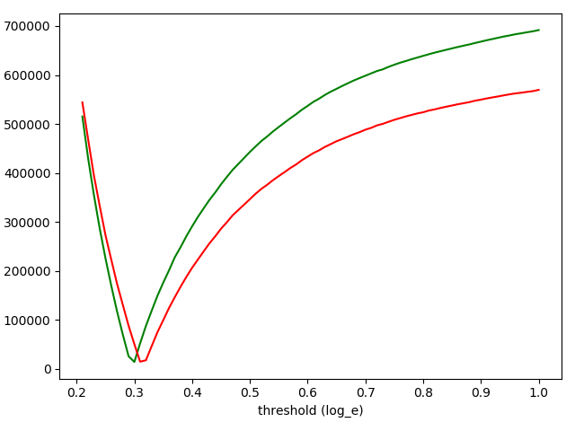
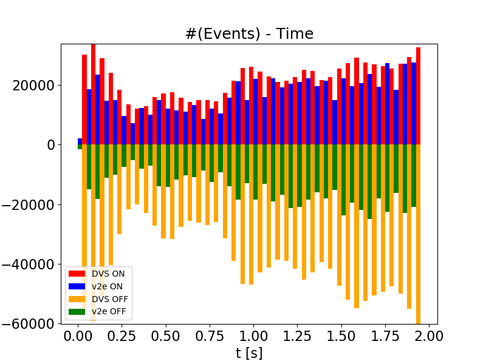

# v2e [](https://opensource.org/licenses/MIT)

Python torch + opencv code to go from conventional stroboscopic video frames with low frame rate into realistic synthetic DVS event streams with much higher effective timing precision. v2e includes finite photoreceptor bandwidth, pixel to pixel event threshold variation, and noise 'leak' events.

See the [v2e home page](https://sites.google.com/view/video2events/home) for videos and further information.

## Contact
Yuhuang Hu (yuhuang.hu@ini.uzh.ch)
Zhe He (hezhehz@live.cn)
Tobi Delbruck (tobi@ini.uzh.ch)

###
If you use v2e, we appreciate a citation to the paper below. See the [v2e home page](https://sites.google.com/view/video2events/home) for futher background papers.

TODO add paper

## Environment

We encourage you to fork v2e and suggest pulls to improve the functionality.

**NOTE** We recommend running _v2e_ on a CUDA GPU or it will be very slow. With a low-end GTX-1050, _v2e_ runs about 50-200X slower than real time using 10X slowdown factor and 346x260 video.

```
python==3.7.7
Ubuntu 18.04 or Windows 10x64
CUDA GPU
```
Code includes pycharm project files for your convenience.

We highly recommend running the code in virtual environment. Conda is always your best friend. :)

For conda users, you can first make an env with pip in it, then install with pip. The torch and opencv-python packages are not available in conda.  Make sure this pip is first in your PATH.

```bash
conda create -n pt-v2e python=3.7 pip
conda activate pt-v2e
```

## Install Dependencies

```bash
conda install pip
which pip # check to make sure your conda pip is first in path
pip install -r requirements.txt
```

## Install the Package


1. For developers, you should install the package with `develop` (in your virtual environment):

    ```bash
    pip install -e .
    ```
  
Using -e will let you modify the code and see the results in your runtime without installing again.
See https://stackoverflow.com/questions/19048732/python-setup-py-develop-vs-install .

2. For users of _v2e.py_, you can install the package with `install`:

    ```bash
    pip install .
    ```


## Usage

_v2e_ serves multiple purposes. Please read to code if you would like to adapt it for your own application. Here, we only introduce the usage for generating DVS events from conventional video and from specific datasets.


## Download SuperSloMo model

We use the excellent [Super SloMo](https://people.cs.umass.edu/~hzjiang/projects/superslomo/) framework to interpolate the APS frames. 
However, since APS frames only record light intensity, we  retrained it on grayscale images. 
You can download our pre-trained model checkpoint from Google Drive 
[[link]](https://drive.google.com/file/d/17QSN207h05S_b2ndXjLrqPbBTnYIl0Vb/view?usp=sharing) (151 MB).


```bash
mkdir -p input
mv SuperSloMo39.ckpt ./input
```
The default value of --slomo_model argument is set to this location.

## Render emulated DVS events from conventional video.

_v2e.py_ reads a standard video (e.g. in .avi, .mp4, .mov, or .wmv) and generates emulated DVS events at upsampled timestamp resolution.

```
(base)$ conda activate pt-v2e # activate your workspace
(pt-v2e)$ python v2e.py -h
usage: v2e.py [-h] [-i INPUT] [--start_time START_TIME]
              [--stop_time STOP_TIME] [--pos_thres POS_THRES]
              [--neg_thres NEG_THRES] [--sigma_thres SIGMA_THRES]
              [--cutoff_hz CUTOFF_HZ] [--leak_rate_hz LEAK_RATE_HZ]
              [--shot_noise_rate_hz SHOT_NOISE_RATE_HZ]
              [--slowdown_factor SLOWDOWN_FACTOR]
              [--output_height OUTPUT_HEIGHT] [--output_width OUTPUT_WIDTH]
              [--slomo_model SLOMO_MODEL] -o OUTPUT_FOLDER
              [--frame_rate FRAME_RATE] [--dvs_vid DVS_VID]
              [--dvs_vid_full_scale DVS_VID_FULL_SCALE] [--dvs_h5 DVS_H5]
              [--dvs_aedat2 DVS_AEDAT2] [--dvs_text DVS_TEXT]
              [--dvs_numpy DVS_NUMPY] [--vid_orig VID_ORIG]
              [--vid_slomo VID_SLOMO] [--no_preview] [--overwrite]
              [--batch_size BATCH_SIZE] [--rotate180 ROTATE180]
v2e: generate simulated DVS events from video.
optional arguments:
  -h, --help            show this help message and exit
  -i INPUT, --input INPUT
                        input video file; leave empty for file chooser dialog.
                        (default: None)
  --start_time START_TIME
                        start at this time in seconds in video. (default:
                        None)
  --stop_time STOP_TIME
                        stop at this time in seconds in video. (default: None)
  --pos_thres POS_THRES
                        threshold in log_e intensity change to trigger a
                        positive event. (default: 0.21)
  --neg_thres NEG_THRES
                        threshold in log_e intensity change to trigger a
                        negative event. (default: 0.17)
  --sigma_thres SIGMA_THRES
                        1-std deviation threshold variation in log_e intensity
                        change. (default: 0.03)
  --cutoff_hz CUTOFF_HZ
                        photoreceptor second-order IIR lowpass filter cutoff-
                        off 3dB frequency in Hz - see
                        https://ieeexplore.ieee.org/document/4444573 (default:
                        0)
  --leak_rate_hz LEAK_RATE_HZ
                        leak event rate per pixel in Hz - see
                        https://ieeexplore.ieee.org/abstract/document/7962235
                        (default: 0)
  --shot_noise_rate_hz SHOT_NOISE_RATE_HZ
                        Temporal noise rate of ON+OFF events in darkest parts
                        of scene; reduced in brightest parts. (default: 0)
  --slowdown_factor SLOWDOWN_FACTOR
                        slow motion factor; if the input video has frame rate
                        fps, then the DVS events will have time resolution of
                        1/(fps*slowdown_factor). (default: 10)
  --output_height OUTPUT_HEIGHT
                        height of output DVS data in pixels. If None, same as
                        input video. (default: 260)
  --output_width OUTPUT_WIDTH
                        width of output DVS data in pixels. If None, same as
                        input video. (default: 346)
  --slomo_model SLOMO_MODEL
                        path of slomo_model checkpoint. (default:
                        input/SuperSloMo39.ckpt)
  -o OUTPUT_FOLDER, --output_folder OUTPUT_FOLDER
                        folder to store outputs. (default: None)
  --frame_rate FRAME_RATE
                        equivalent frame rate of --dvs_vid output video; the
                        events will be accummulated as this sample rate; DVS
                        frames will be accumulated for duration 1/frame_rate
                        (default: 300)
  --dvs_vid DVS_VID     output DVS events as AVI video at frame_rate.
                        (default: dvs-video.avi)
  --dvs_vid_full_scale DVS_VID_FULL_SCALE
                        set full scale count for DVS videos to be this many ON
                        or OFF events. (default: 3)
  --dvs_h5 DVS_H5       output DVS events as hdf5 event database. (default:
                        None)
  --dvs_aedat2 DVS_AEDAT2
                        output DVS events as DAVIS346 camera AEDAT-2.0 event
                        file for jAER; one file for real and one file for v2e
                        events. (default: None)
  --dvs_text DVS_TEXT   output DVS events as text file with one event per line
                        [timestamp (float s), x, y, polarity (0,1)]. (default:
                        None)
  --dvs_numpy DVS_NUMPY
                        accumulates DVS events to memory and writes final
                        numpy data file with this name holding vector of
                        events. WARNING: memory use is unbounded. (default:
                        None)
  --vid_orig VID_ORIG   output src video at same rate as slomo video (with
                        duplicated frames). (default: video_orig.avi)
  --vid_slomo VID_SLOMO
                        output slomo of src video slowed down by
                        slowdown_factor. (default: video_slomo.avi)
  --no_preview          disable preview in cv2 windows for faster processing.
                        (default: False)
  --overwrite           overwrites files in existing folder (checks existence
                        of non-empty output_folder). (default: False)
  --batch_size BATCH_SIZE
                        batch size for SuperSloMo. May only support
                        batch_size=1. (default: 1)
  --rotate180 ROTATE180
                        rotate all output 180 deg. (default: False)
Run with no --input to open file dialog


```
You can put [tennis.mov](https://drive.google.com/file/d/1dNUXJGlpEM51UVYH4-ZInN9pf0bHGgT_/view?usp=sharing) in the _input_ folder to try it out with the command line below.

```
python v2e.py -i input/tennis.mov --slowdown_factor=10 --output_folder=output --pos_thres=.15 --neg_thres=.15 --sigma_thres=0.01 --frame_rate=300 --dvs_aedat2 tennis.aedat --output_width=346 --output_height=260
```
Run the command above, and the following files will be created in a folder called _output_.

```
original.avi  slomo.avi  dvs-video.avi  tennis.aedat 
```

* _original.avi_: input video, but converted to luma and resized to output (width,height) and with repeated frames to allow comparison to _slomo.avi_.
* _slomo.avi_: slow motion video (with playback rate 30Hz) but slowed down by slowdown_factor.
* _dvs-video.avi_: DVS video (with playback rate 30Hz) but with frame rate (DVS timestamp resolution) set by source video frame rate times slowdown_factor.
* _tennis.aedat_: AEDAT-2.0 file for playback and algorithm experiments in [jAER](https://jaerproject.net) (use the AEChip _Davis346Blue_ to play this file.)

The [v2e site](https://sites.google.com/view/video2events/home) shows these videos.

## Model parameters

The DVS ON and OFF threshold nominal values are set by _pos_thres_ and _neg_thres_. The pixel to pixel variation is set by _sigma_thres_. The pixel cutoff frequency in Hz is set by _cutoff_hz_. The leak event rate is set by _leak_rate_hz_. 

See our technical paper for futher information about these parameters.
 
 ### Frame rate and DVS timestamp resolution in v2e
 The _frame_rate_ parameter sets the output frame rate of DVS movies. It does not affect the generated DVS events, only how they are rendered to make the AVI movies.
 
 The timestep resolution of the generated DVS events is set by combining the source frame rate and _slowdown_factor_ parameters. For example, if the source video is at 30Hz frame rate and _slowdown_factor_ is 20, then the DVS events will have timestamp resolution of 1/(30*20)s=1/600s=1.66ms.
 
## DAVIS camera conversion Dataset

v2e can convert recordings from [DDD17](https://docs.google.com/document/d/1HM0CSmjO8nOpUeTvmPjopcBcVCk7KXvLUuiZFS6TWSg/pub) which is the first public end-to-end training dataset 
of automotive driving using a DAVIS event + frame camera. It lets you compare the real DVS data with the conversion. 
This dataset is maintained by the Sensors Research Group of Institute of Neuroinformatics. 
Please go to the datasets website [[link]](http://sensors.ini.uzh.ch/databases.html) of Sensors Group  for details about downloading _DDD17_.

For your convenience, we put one recording from _DDD20_ (our newer DDD dataset) of 800s of
Los Angeles street driving. 
The file is _aug04/rec1501902136.hdf5_ [[link]](https://drive.google.com/open?id=1KIaHsn72ZpVBZR6SGeFcd2lILyZoD2-5)
  in Google Drive for you to try it with v2e (***Warning:*** 2GB 7z compressed, 5.4 GB uncompressed).

```bash
mkdir -p input
mv rec1501902136.hdf5 ./input
```

**NOTE** you must run these scripts with the _-m package.script.py_ notation, not by directly pointing to the .py file.

### Extract data from DDD recording

_ddd_h5_extract_data.py_ extracts the DDD recording DVS events to jAER _.aedat_ and video _.avi_ files.

```
(pt-v2e) $ python -m dataset_scripts.ddd.ddd_extract_data.py -h
usage: ddd_h5_extract_data.py [-h] [-i INPUT] -o OUTPUT_FOLDER
                              [--start_time START_TIME]
                              [--stop_time STOP_TIME] [--rotate180]
                              [--overwrite]

optional arguments:
  -h, --help            show this help message and exit
  -i INPUT, --input INPUT
                        input video file; leave empty for file chooser dialog
  -o OUTPUT_FOLDER, --output_folder OUTPUT_FOLDER
                        folder to store outputs
  --start_time START_TIME
                        start at this time in seconds in video
  --stop_time STOP_TIME
                        stop point of video stream
  --rotate180           rotate output 180 deg
  --overwrite           overwrites files in existing folder (checks existance
                        of non-empty output_folder)

```
Running it from python console with
```python
runfile('E:\\Dropbox\\GitHub\\SensorsINI\\v2e\\ddd_extract_data.py', args=['--overwrite', '--output_folder=output/output-ddd-h5-data', '--overwrite', '--rotate180'], wdir='E:/Dropbox/GitHub/SensorsINI/v2e')
```
produces
```
output/output-ddd-h5-data/rec1501350986.aedat
output/output-ddd-h5-data/rec1501350986.avi
```
### Synthesize events from DDD recording

_ddd-v2e.py_ is like _v2e.py_ but it reads DDD .hdf5 recordings and extracts the real DVS events from the same part of the recording used for the synthesis of DVS events.

You can try it like this: 
```
$ python -m dataset_scripts.ddd.ddd-v2e.py --input input/rec1501350986.hdf5 --slomo_model input/SuperSloMo39.ckpt --slowdown_factor 20 --start 70 --stop 73 --output_folder output/ddd20-v2e-short --dvs_aedat dvs --pos_thres=.2 --neg_thres=.2 --overwrite --dvs_vid_full_scale=2 --frame_rate=100
INFO:__main__:arguments:
cutoff_hz:      300
dvs_aedat2:     dvs
dvs_h5: None
dvs_text:       None
dvs_vid:        dvs-video.avi
dvs_vid_full_scale:     2
frame_rate:     100
input:  input/rec1501350986.hdf5
leak_rate_hz:   0.05
neg_thres:      0.2
no_preview:     False
output_folder:  output/ddd20-v2e-short
output_height:  260
output_width:   346
overwrite:      True
pos_thres:      0.2
rotate180:      True
sigma_thres:    0.03
slomo_model:    input/SuperSloMo39.ckpt
slowdown_factor:        20
start_time:     70.0
stop_time:      73.0
vid_orig:       video_orig.avi
vid_slomo:      video_slomo.avi

INFO:__main__:opening output files
INFO:src.slomo:CUDA available, running on GPU :-)
INFO:src.emulator:ON/OFF log_e temporal contrast thresholds: 0.2 / 0.2 +/- 0.03
INFO:src.emulator:opening AEDAT-2.0 output file output/ddd20-v2e-short/dvs.aedat
INFO:root:opening AEDAT-2.0 output file output/ddd20-v2e-short/dvs.aedat in binary mode
INFO:src.output.aedat2_output:opened output/ddd20-v2e-short/dvs.aedat for DVS output data for jAER
INFO:src.ddd20_utils.ddd_h5_reader:making reader for DDD recording input/rec1501350986.hdf5
INFO:src.ddd20_utils.ddd_h5_reader:input/rec1501350986.hdf5 contains following keys
accelerator_pedal_position
brake_pedal_status
dvs

...

INFO:src.ddd20_utils.ddd_h5_reader:input/rec1501350986.hdf5 has 38271 packets with start time 1123.34s and end time 1246.31s (duration    123.0s)
INFO:src.ddd20_utils.ddd_h5_reader:searching for time 70.0
ddd-h5-search:  56%|███████████████████████████████████████▉                                | 21244/38271 [00:08<00:05, 3002.45packet/s]INFO:src.ddd20_utils.ddd_h5_reader:
found start time 70.0 at packet 21369

...

:src.v2e_utils:opened output/ddd20-v2e-short/dvs-video-real.avi with  XVID https://www.fourcc.org/ codec, 30.0fps, and (346x260) size
v2e-ddd20:   5%|███▊                                                                              | 51/1100 [00:00<00:15, 67.70packet/s]INFO:src.slomo:loading SuperSloMo model from input/SuperSloMo39.ckpt

```

The generated outputs in folder _output/ddd20-v2e-short_ will be
```
dvs-v2e.aedat
dvs-v2e-real.aedat
dvs-video-fake.avi
dvs-video-real.avi
info.txt
original.avi
slomo.avi
```


## Calibrate the Thresholds

_ddd_find_thresholds.py_ estimates the correct thresholds of triggering ON and OFF events, you can use a synhronized DAVIS recording from the DDD dataset:

```
$ python  -m dataset_scripts.ddd.ddd_find_thresholds.py -h
usage: ddd_find_thresholds.py [-h] [--start START] [--stop STOP] [-i I] [-o O]
                              [--slowdown_factor SLOWDOWN_FACTOR]
                              [--slomo_model SLOMO_MODEL] [--no_preview]

ddd_find_thresholds.py: generate simulated DVS events from video with sweep of
thresholds to compare with real DVS to find optimal thresholds.

optional arguments:
  -h, --help            show this help message and exit
  --start START         start point of video stream (default: 0.0)
  --stop STOP           stop point of video stream (default: 5.0)
  -i I                  path of DDD .hdf5 file (default: None)
  -o O                  path to where output is stored (default:
                        output/find_thresholds)
  --slowdown_factor SLOWDOWN_FACTOR
                        slow motion factor (default: 10)
  --slomo_model SLOMO_MODEL
                        path of slomo_model checkpoint. (default:
                        input/SuperSloMo39.ckpt)
  --no_preview          disable preview in cv2 windows for faster processing.
                        (default: False)

Run with no --input to open file dialog

```
You can run it like this:

```bash
python  -m dataset_scripts.ddd.ddd_find_thresholds.py -i input\rec1501350986.hdf5 --start 25 --stop 35
```
Make sure you use part of the recording where the input is changing. If you use the ROI option you can focus the estimation on parts of the scene that are definitely changing, to avoid counting just noise events. If you happen to select such a region, then _ddd_find_thresholds.py_ will find an artificially low threshold to generate enough events compared with the real DVS (if you don't set the correct _leak_rate_hz_ and _shot_noise_rate_hz_ parameters). 

The program will take the DVS recording data, which starts at time 'start' and ends at time 'end', to calculate the best threshold values for positive and negative self separately.

A typical result from _ddd_find_thresholds.py_ is shown below. It plots the absolute difference in ON and OFF event counts between the real and v2e data. ON counts are green and OFF counts are red. The smallest difference between real and v2e DVS event counts is found at about 0.3. It means that this recording use a DVS threshold of about 0.3 log_e units, or about +35% and -25% intensity change.



### Obtaining acceptable results 
For the best frame interpolation by SuperSloMo, the input video needs to satisfy the requirements below,

- Daytime - for short exposure times to avoid motion-blurred frames.
- Cloudy - for limited dynamic range, to ensure that the frames are not clipped.
- High frame rate - objects must not be aliased too much, i.e. they must not move too much between frames.

If the video is underexposed, overexposed, has motion blur or aliasing, then the emulated DVS events will have poor realism.

### Default Thresholds ####
_pos_thres_: 0.25
_neg_thres_: 0.35
Both of them are approximated based on the file rec1500403661.hdf5.

**NOTE** 

The thresholds vary slightly depending on the time interval of the input APS frames.

|  Time Interval   |  _pos_thres_ | _neg_thres_ |
|  ----  | ----  | ----|
| 5s - 15s  | 0.25 | 0.36|
| 15s - 25s  | 0.24 | 0.33|
| 25s - 35s  | 0.21 | 0.31|
| 35s - 45s  | 0.22 | 0.33|

All the thresholds above are estimated based on the file rec1500403661.hdf5. The estimated thresholds also slightly vary depending on the input file. For example, based on the APS frames in the time interval 35s - 45s from the file rec1499025222.hdf5, the estimated positive threshold is 0.28, and the estimated negative threshold is 0.42.


### Plot the DDD event counts from v2e versus real DVS

After running _ddd-v2e.py_, _ddd_plot_event_counts.py_ reads the saved numpy files holding the real and v2e events from _ddd-v2e.py_ (**if you enabled --numpy_output**) and plots the event counts over an ROI. 

Running it like below
```bash
python -m dataset_scripts.ddd.ddd_plot_event_counts.py --path output\ddd20-v2e-short --start 0 --stop 2 --x 0 345 --y 0 259
```
produces the output


This run used the default bin duration of 50ms. The plot shows the count of ON and OFF events over the entire pixel array for real DVS and emulated v2e. We can see that the ON threshold is approximately correct, while the OFF threshold for v2e was too small; too many v2e events were generated.

Another example is shown below: The left side is the ground-truth DVS frames, and the figure on the right side shows the histogram plot of the generated DVS events within the region denoted by the black box. Histograms of the ground-truth self and our generated self are plotted in the same figure. It can be seen that the distribution of generated v2e events is quite similar to the distribution of the real DVS events.

<p float="left">
  
   
</p>

## Working with jAER DAVIS recordings

DAVIS cameras like the one that recorded DDD17 and DDD20 are often used with [jAER](https://jaerproject.net) (although DDD recordings were made with custom python wrapper around caer). _v2e_ will output a jAER-compatible .aedat file in [AEDAT-2.0 format](https://inivation.com/support/software/fileformat/#aedat-20), which jAER uses.

To work with existing jAER DAVIS .aedat, you can export the DAVIS APS frames using the jAER EventFilter [DavisFrameAVIWriter](https://github.com/SensorsINI/jaer/blob/master/src/ch/unizh/ini/jaer/projects/davis/frames/DavisFrameAviWriter.java); see the [jAER user guide](https://docs.google.com/document/d/1fb7VA8tdoxuYqZfrPfT46_wiT1isQZwTHgX8O22dJ0Q/edit?usp=sharing), in particular, the [section about using DavisFrameAVIWriter](https://docs.google.com/document/d/1fb7VA8tdoxuYqZfrPfT46_wiT1isQZwTHgX8O22dJ0Q/edit#heading=h.g4cschniofmo). In DavisFrameAVIWriter, **don't forget to set the frameRate to the actual frame rate of the DAVIS frames** (which you can see at the top of the jAER display). This will make the conversion have approximately the correct DVS event timing. (jAER can drop APS frames if there are too many DVS events, so don't count on this.) Once you have the AVI from jAER, you can generate v2e events from it with _v2e.py_ and see how they compare with the original DVS events in jAER, by playing the exported v2e .aedat file in jAER.

An example of this conversion and comparison is on the [v2e home page](https://sites.google.com/view/video2events/home).

## Generating Synthetic DVS Dataset from UCF-101 action recognition dataset ##

**NOT CURRENTLY WORKING**

_ucf101_single.py_ generates synthetic data from a single input video from the action recognition dataset [UCF-101](https://www.crcv.ucf.edu/data/UCF101.php).

```bash
python ucf101_single.py \
--input [path to the input video] \
--pos_thres [positive threshold] \
--neg_thres [negative threshold] \
--sf [slow motion factor] \
--checkpoint [the .ckpt checkpoint of the slow motion network] \
--output_dir [path to store the output videos]
```

The code needs to be modified if the input video is from a different dataset.

## Technical Details ##

See the [v2e home page](https://sites.google.com/view/video2events/home).
